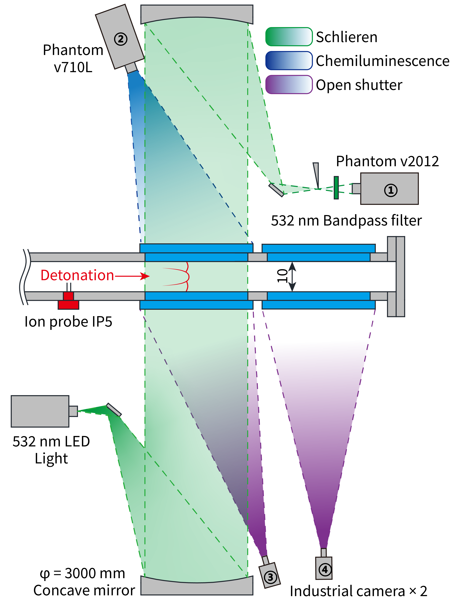

Long-Exposure Detonation Cell Image Dataset
长曝光爆轰胞格图像数据集
Currently, this repository mainly contains low-pressure experimental data for gas mixtures including C2H2+2.5O2, C2H2+2.5O2+50%Ar, and C2H2+2.5O2+70%Ar. The cell segmentation results, cell size statistics, and the related segmentation models are being continuously compiled and are scheduled to be released shortly.
目前，本仓库主要包含 C2H2+2.5O2、C2H2+2.5O2+50%Ar 以及 C2H2+2.5O2+70%Ar 混合气在低压条件下的实验数据。胞格分割结果、胞格尺寸统计数据以及分割模型正在持续整理中，预计将于近期发布。

We will continuously update the repository with more experimental data for different gas mixtures, schlieren images, and improved segmentation models in the future.
未来，我们将持续更新更多混合物工况的实验数据、纹影图像以及分割模型。

The current experimental setup is illustrated in the figure below. Note: Due to the physical constraints of the facility dimensions (a 10 mm narrow channel), the cell sizes obtained here may differ from those measured in traditional detonation tubes (e.g., those with square or circular cross-sections).
实验装置目前如下图所示。注意：受限于装置物理尺寸（10 mm 窄通道），此处获得的胞格尺寸可能与传统爆轰管（方形或圆形截面）中测得的胞格尺寸有所不同。

All images have undergone batch preprocessing for dimensional calibration. As a result, the standard image size is 2500 × 1500 pixels, with a unified spatial resolution of 10 pixels/mm.
所有图像均已通过批量预处理进行了尺寸校正。校正后的标准图像尺寸为 2500 × 1500 像素，统一的空间分辨率为 10 像素/毫米。

The author is expected to graduate in April 2027. This repository will be continuously maintained and updated with new data until then.
作者预计将于 2027 年 4 月毕业。在此日期之前，本仓库的数据集将持续进行维护和更新。

If you use the data or models from this repository in your research, please consider citing our work:
若您在研究中使用了本仓库的数据或模型，请酌情引用以下文献：

Yang, Z., Wang, C., Cao, D., Cheng, J., Zhang, B., 2026. Unveiling detonation onset dynamics in the narrow channel: Synchronized multi-modal optical diagnostics. Combust. Flame 283, 114551. https://doi.org/10.1016/j.combustflame.2025.114551

For access to more comprehensive detonation cell data or potential experimental collaborations, please feel free to contact us:

Email: yangzezhong@sjtu.edu.cn

Researchers in China are welcome to add the author directly on WeChat for further discussion.

如需获取更全面的胞格数据或探讨实验合作，请随时与我们联系：

作者邮箱： yangzezhong@sjtu.edu.cn

国内研究人员欢迎直接添加作者微信进行学术交流。

