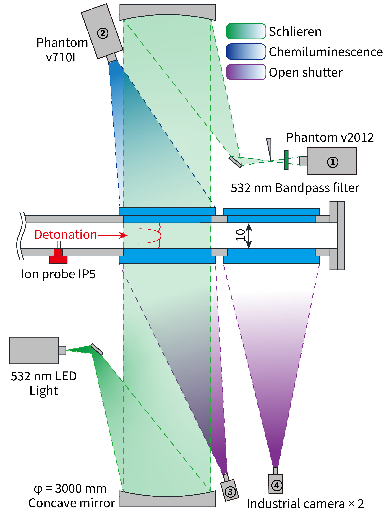

# Long-Exposure Detonation Cell Image Dataset 

## Experimental Procedure

Currently, this repository mainly contains low-pressure experimental data for gas mixtures including:
-C2H2+2.5O2
-C2H2+2.5O2+50%Ar 
-C2H2+2.5O2+70%Ar

We will continuously update the repository with more experimental data for different gas mixtures, different diluent gas, schlieren images, and improved segmentation models in the future.

The current experimental setup is illustrated in the figure below. Note: Due to the physical constraints of the facility dimensions (a 10 mm narrow channel), the cell sizes obtained here may differ from those measured in traditional detonation tubes (e.g., those with square or circular cross-sections).

## Dataset Processing

All images have undergone batch preprocessing for dimensional calibration. As a result, the standard image size is 2500 × 1500 pixels, with a unified spatial resolution of 10 pixels/mm.

We adopt Cellpose-SAM as our base model,fine-tuning with high-fidelity detonation datasets for detonation cell segmentaiton. The cell segmentation results, cell size statistics, and the related segmentation models are being continuously compiled and are scheduled to be released shortly.

## Citation

If you use the data or models from this repository in your research, please consider citing our work:

Yang, Z., Wang, C., Cao, D., Cheng, J., Zhang, B., 2026. Unveiling detonation onset dynamics in the narrow channel: Synchronized multi-modal optical diagnostics. Combust. Flame 283, 114551. https://doi.org/10.1016/j.combustflame.2025.114551

For access to more comprehensive detonation cell data or potential experimental collaborations, please feel free to contact us:

Email: ruicai0121@sjtu.edu.cn; yangzezhong@sjtu.edu.cn

Researchers in China are welcome to add the author directly on WeChat for further discussion.

